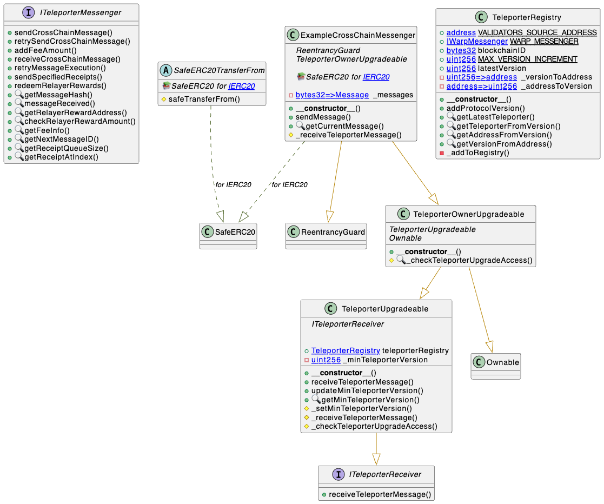

# Upgradeability

## Overview

The `TeleporterMessenger` contract is non-upgradable, once a version of the contract is deployed it cannot be changed. This is with the intention of preventing any changes to the deployed contract that could potentially introduce bugs or vulnerabilities.

However, there could still be new versions of `TeleporterMessenger` contracts needed to be deployed in the future. `TeleporterRegistry` provides applications that use a `TeleporterMessenger` instance a minimal step process to integrate with new versions of `TeleporterMessenger`.

The `TeleporterRegistry` maintains a mapping of `TeleporterMessenger` contract versions to their addresses. When a new `TeleporterMessenger` version is deployed, its address can be added to the `TeleporterRegistry`. The `TeleporterRegistry` can only be updated through a Warp off-chain message that meets the following requirements:

- `sourceChainAddress` must match `VALIDATORS_SOURCE_ADDRESS = address(0)`
  - The zero address can only be set as the source chain address by a Warp off-chain message, and cannot be set by an on-chain Warp message.
- `sourceBlockchainID` must match the blockchain ID that the registry is deployed on
- `destinationBlockchainID` must match the blockchain ID that the registry is deployed on
- `destinationAddress` must match the address of the registry

In the `TeleporterRegistry` contract, the `latestVersion` state variable returns the highest version number that has been registered in the registry. The `getLatestTeleporter` function returns the `ITeleporterMessenger` that is registered with the corresponding version.

## Design

- `TeleporterRegistry` is deployed on each blockchain that needs to keep track of `TeleporterMessenger` contract versions.
- Each registry's mapping of version to contract address is independent of registries on other blockchains, and chains can decide on their own registry mapping entries.
- `TeleporterRegistry` contract can be initialized through a list of initial registry entries, which are `TeleporterMessenger` contract versions and their addresses.
- The registry keeps track of a mapping of `TeleporterMessenger` contract versions to their addresses, and vice versa, a mapping of `TeleporterMessenger` contract addresses to their versions.
- Version zero is an invalid version, and is used to indicate that a `TeleporterMessenger` contract has not been registered yet.
- Once a version number is registered in the registry, it cannot be changed, but a previous registered protocol address can be added to the registry with a new version. This is especially important in the case of a rollback to a previous Teleporter version, in which case the previous Teleporter contract address would need to be registered with a new version to the registry.

## How to use `TeleporterRegistry`

<div align="center">
  
</div>

`TeleporterUpgradeable` is an abstract contract that helps integrate the `TeleporterRegistry` into a dapp. The dapp contract can inherit `TeleporterUpgradeable`, and pass in the Teleporter registry address inside the constructor. An example app looks like:

```solidity
// An example app that integrates with the Teleporter registry
// to send/receive Teleporter messages.
contract ExampleApp is
    TeleporterUpgradeable
{
    ...
    // Constructor passes in the Teleporter registry address
    // to the TeleporterUpgradeable contract.
    constructor(
        address teleporterRegistryAddress
    ) TeleporterUpgradeable(teleporterRegistryAddress) {
        currentBlockchainID = IWarpMessenger(WARP_PRECOMPILE_ADDRESS)
            .getBlockchainID();
    }
    ...
    // Handles receiving Teleporter messages,
    // and also checks that the sender is a valid Teleporter contract.
    function _receiveTeleporterMessage(
        bytes32 originBlockchainID,
        address originSenderAddress,
        bytes memory message
    ) internal override {
        // implementation
    }

    // Implements the access control checks for the dapp's interaction with Teleporter versions.
    function _checkTeleporterUpgradeAccess() internal view virtual override {
        //implementation
    }

}
```

The `TeleporterUpgradeable` contract saves the Teleporter registry in a state variable used by the inheriting contract, and initializes a `minTeleporterVersion` to the highest `TeleporterMessenger` version registered in `TeleporterRegistry`. `TeleporterUpgradeable` also provides an initial implementation of [ITeleporterReceiver.receiveTeleporterMessage](../ITeleporterReceiver.sol) that ensures `msg.sender` is a `TeleporterMessenger` contract with a version greater than or equal to `minTeleporterVersion`. This supports the case where a dapp wants to upgrade to a new version of the `TeleporterMessenger` contract, but still wants to be able to receive messages from the old Teleporter contract.The dapp can override `_receiveTeleporterMessage` to implement its own logic for receiving messages from Teleporter contracts.

The `TeleporterUpgradeable.updateMinTeleporterVersion` function updates the `minTeleporterVersion` used to check which Teleporter versions can deliver messages to the dapp, and emits the `MinTeleporterVersionUpdated` event. The `updateMinTeleporterVersion` function should **ONLY** be called by the dapp when it completes delivery of messages from the old Teleporter contract, and now wants to update the `minTeleporterVersion` to only allow the new Teleporter version. By default, `updateMinTeleporterVersion` can only be called with a version greater than the current `minTeleporterVersion` and less than `latestVersion` in the Teleporter registry. So once this function is called, the dapp will no longer be able to receive messages from the old Teleporter contract version, unless the old version's Teleporter address was registered in the registry again with a new version.

To prevent anyone from calling the dapp's `updateMinTeleporterVersion`, which would disallow messages from old Teleporter versions from being received, this function should be safeguarded with access controls. All contracts deriving from `TeleporterUpgradeable` will need to implement `TeleporterUpgradeable._checkTeleporterUpgradeAccess`. For example, [TeleporterOwnerUpgrade](./TeleporterOwnerUpgradeable.sol) is an abstract contract that inherits `TeleporterUpgradeable`, and implements `_checkTeleporterUpgradeAccess` to check whether the caller is the owner.

```solidity
    function _checkTeleporterUpgradeAccess() internal view virtual override {
        _checkOwner();
    }
```

For sending messages with the Teleporter registry, dapps should generally use `TeleporterUpgradeable._getTeleporterMessenger`, which by default will use the latest version. If the dapp wants to send a message through a specific Teleporter version, it can override `_getTeleporterMessenger()` to use the specific Teleporter version with  `TeleporterRegistry.getTeleporterFromVersion`.

Using latest version:

```solidity
        ITeleporterMessenger teleporterMessenger = _getTeleporterMessenger();
```

Using specific version:

```solidity
        // Override _getTeleporterMessenger to use specific version.
        function _getTeleporterMessenger() internal view override returns (ITeleporterMessenger) {
            ITeleporterMessenger teleporter = teleporterRegistry
                .getTeleporterFromVersion($VERSION);
            require(
                !pausedTeleporterAddresses[address(teleporter)],
                "TeleporterUpgradeable: Teleporter sending version paused"
            );

            return teleporter;
        }

        ITeleporterMessenger teleporterMessenger = _getTeleporterMessenger();
```

## Pausing Teleporter interactions

Dapps that inherit from `TeleporterUpgradeable` can pause Teleporter interactions by calling `TeleporterUpgradeable.pauseTeleporterAddress`. This function prevents the contract from interacting with the paused Teleporter  address via `_getTeleporterMessenger()`. 

`pauseTeleporterAddress` can only be called by addresses with the dapp's upgrade access, checked through `TeleporterUpgradeable._checkTeleporterUpgradeAccess`. 