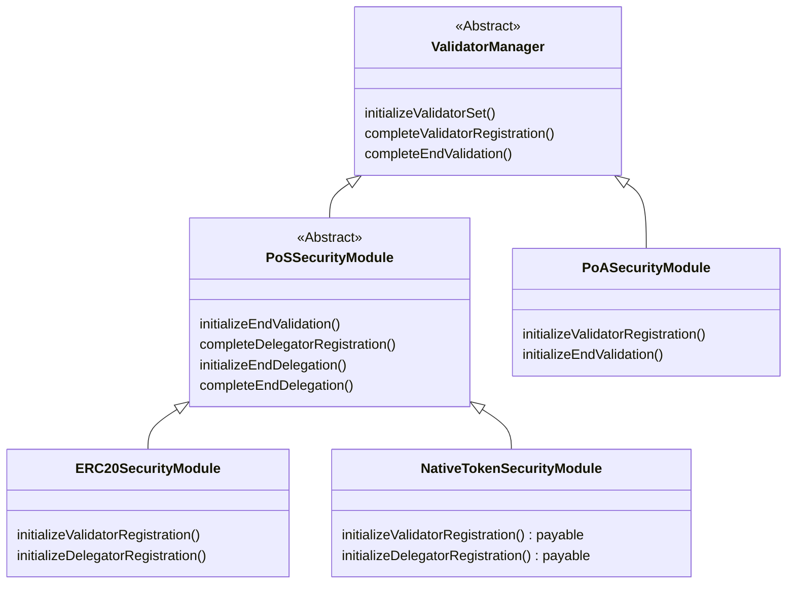

# Validator Manager Contract

The contracts in this directory define the Validator Manager used to manage Avalanche L1 validators, as defined in [ACP-77](https://github.com/avalanche-foundation/ACPs/tree/main/ACPs/77-reinventing-subnets). `ValidatorManager.sol` is the top-level abstract contract that provides the basic functionality. The other contracts are related as follows:



## Deploying

Three concrete `ValidatorManager` contracts are provided - `PoASecurityModule`, `NativeTokenSecurityModule`, and `ERC20SecurityModule`. `NativeTokenSecurityModule`, and `ERC20SecurityModule` implement `PoSSecurityModule`, which itself implements `ValidatorManager`. These are implemented as [upgradeable](https://github.com/OpenZeppelin/openzeppelin-contracts-upgradeable/blob/main/contracts/proxy/utils/Initializable.sol#L56) contracts. There are numerous [guides](https://blog.chain.link/upgradable-smart-contracts/) for deploying upgradeable smart contracts, but the general steps are as follows:

1. Deploy the implementation contract
2. Deploy the proxy contract
3. Call the implementation contract's `initialize` function

- Each flavor of `ValidatorManager` requires different settings. For example, `ValidatorManagerSettings` specifies the churn parameters, while `PoSSecurityModuleSettings` specifies the staking and rewards parameters.

4. Initialize the validator set by calling `initializeValidatorSet`

- When a Subnet is first created on the P-Chain, it must be explicitly converted to an L1 via [`ConvertSubnetToL1Tx`](https://github.com/avalanche-foundation/ACPs/tree/main/ACPs/77-reinventing-subnets#convertsubnettol1tx). The resulting `SubnetToL1ConversionMessage` Warp [message](https://github.com/avalanche-foundation/ACPs/tree/main/ACPs/77-reinventing-subnets#subnettol1conversionmessage) is provided in the call to `initializeValidatorSet` to specify the starting validator set in the `ValidatorManager`. Regardless of the implementation, these initial validators are treated as PoA and are not eligible for staking rewards.

### PoASecurityModule

Proof-of-Authority validator management is provided via `PoASecurityModule`, which restricts modification of the validator set to a specified owner address. After deploying `PoASecurityModule.sol` and a proxy, the `initialize` function takes the owner address, in addition to standard `ValidatorManagerSettings`.

### PoSSecurityModule

Proof-of-Stake validator management is provided by the abstract contract `PoSSecurityModule`, which has two concrete implementations: `NativeTokenSecurityModule` and `ERC20SecurityModule`. In addition to basic validator management provided in `ValidatorManager`, `PoSSecurityModule` supports uptime-based validation rewards, as well as delegation to a chosen validator. The `uptimeBlockchainID` used to initialize the `PoSSecurityModule` **must** be validated by the L1 validator set that the contract manages. **There is no way to verify this from within the contract, so take care when setting this value.** This [state transition diagram](./StateTransition.md) illustrates the relationship between validators and delegators.

> [!NOTE]
> The `weightToValueFactor` fields of the `PoSSecurityModuleSettings` passed to `PoSSecurityModule`'s `initialize` function sets the factor used to convert between the weight that the validator is registered with on the P-Chain, and the value transferred to the contract as stake. This involves integer division, which may result in loss of precision. When selecting `weightToValueFactor`, it's important to make the following considerations:
>
> 1. If `weightToValueFactor` is near the denomination of the asset, then staking amounts on the order of 1 unit of the asset may cause the converted weight to round down to 0. This may impose a larger-than-expected minimum stake amount.
>    - Ex: If USDC (denomination of 6) is used as the staking token and `weightToValueFactor` is 1e9, then any amount less than 1,000 USDC will round down to 0 and therefore be invalid.
> 2. Staked amounts up to `weightValueFactor - 1` may be lost in the contract as dust, as the validator's registered weight is used to calculate the original staked amount.
>    - Ex: `value=1001` and `weightToValueFactor=1e3`. The resulting weight will be `1`. Converting the weight back to a value results in `value=1000`.
> 3. The validator's weight is represented on the P-Chain as a `uint64`. `PoSSecurityModule` restricts values such that the calculated weight does not exceed the maximum value for that type.

#### NativeTokenSecurityModule

`NativeTokenSecurityModule` allows permissionless addition and removal of validators that post the L1's native token as stake. Staking rewards are minted via the Native Minter Precompile, which is configured with a set of addresses with minting privileges. As such, the address that `NativeTokenSecurityModule` is deployed to must be added as an admin to the precompile. This can be done by either calling the precompile's `setAdmin` method from an admin address, or setting the address in the Native Minter precompile settings in the chain's genesis (`config.contractNativeMinterConfig.adminAddresses`). There are a couple of methods to get this address: one is to calculate the resulting deployed address based on the deployer's address and account nonce: `keccak256(rlp.encode(address, nonce))`. The second method involves manually placing the `NativeTokenSecurityModule` bytecode at a particular address in the genesis, then setting that address as an admin.

```json
{
    "config" : {
        ...
        "contractNativeMinterConfig": {
            "blockTimestamp": 0,
            "adminAddresses": [
                "0xffffffffffffffffffffffffffffffffffffffff"
            ]
        }
    },
    "alloc": {
        "0xffffffffffffffffffffffffffffffffffffffff": {
            "balance": "0x0",
            "code": "<NativeTokenSecurityModuleByteCode>",
            "nonce": 1
        }
    }
}
```

#### ERC20SecurityModule

`ERC20SecurityModule` allows permissionless addition and removal of validators that post the an ERC20 token as stake. The ERC20 is specified in the call to `initialize`, and must implement [`IERC20Mintable`](./interfaces/IERC20Mintable.sol). Care should be taken to enforce that only authorized users are able to `mint` the ERC20 staking token.

### Convert PoA to PoS

A `PoASecurityModule` can later be converted to a `PoSSecurityModule` by upgrading the implementation contract pointed to by the proxy. After performing the upgrade, the `PoSSecurityModule` contract should be initialized by calling `initialize` as described above. The validator set contained in the `PoASecurityModule` will be tracked by the `PoSSecurityModule` after the upgrade, but these validators will neither be eligible to stake and earn staking rewards, nor support delegation.

## Usage

### Register a Validator

Validator registration is initiated with a call to `initializeValidatorRegistration`. The sender of this transaction is registered as the validator owner. Churn limitations are checked - only a certain (configurable) percentage of the total weight is allowed to be added or removed in a (configurable) period of time. The `ValidatorManager` then constructs a [`RegisterL1ValidatorMessage`](https://github.com/avalanche-foundation/ACPs/tree/main/ACPs/77-reinventing-subnets#registerl1validatormessage) Warp message to be sent to the P-Chain. Each validator registration request includes all of the information needed to identify the validator and its stake weight, as well as an `expiry` timestamp before which the `RegisterL1ValidatorMessage` must be delivered to the P-Chain. If the validator is not registered on the P-Chain before the `expiry`, then the validator may be removed from the contract state by calling `completeEndValidation`.

The `RegisterL1ValidatorMessage` is delivered to the P-Chain as the Warp message payload of a `RegisterL1ValidatorTx`. Please see the transaction [specification](https://github.com/avalanche-foundation/ACPs/tree/main/ACPs/77-reinventing-subnets#registerl1validatortx) for validity requirements. The P-Chain then signs a [`L1ValidatorRegistrationMessage`](https://github.com/avalanche-foundation/ACPs/tree/main/ACPs/77-reinventing-subnets#l1validatorregistrationmessage) Warp message indicating that the specified validator was successfully registered on the P-Chain.

The `L1ValidatorRegistrationMessage` is delivered to the `ValidatorManager` via a call to `completeValidatorRegistration`. For PoS Validator Managers, staking rewards begin accruing at this time.

### Remove a Validator

Validator exit is initiated with a call to `initializeEndValidation` on the `ValidatorManager`. Only the validator owner may initiate exit. For `PoSSecurityModules` a [`ValidationUptimeMessage`](./UptimeMessageSpec.md) Warp message may optionally be provided in order to calculate the staking rewards; otherwise the latest received uptime will be used (see [(PoS only) Submit and Uptime Proof](#pos-only-submit-an-uptime-proof)). This proof may be requested directly from the L1 validators, which will provide it in a `ValidationUptimeMessage` Warp message. If the uptime is not sufficient to earn validation rewards, the call to `initializeEndValidation` will fail. `forceInitializeEndValidation` acts the same as `initializeEndValidation`, but bypasses the uptime-based rewards check. Once `initializeEndValidation` or `forceInitializeEndValidation` is called, staking rewards cease accruing for `PoSSecurityModules`.

The `ValidatorManager` contructs an [`L1ValidatorWeightMessage`](https://github.com/avalanche-foundation/ACPs/tree/main/ACPs/77-reinventing-subnets#l1validatorweightmessage) Warp message with the weight set to `0`. This is delivered to the P-Chain as the payload of a [`SetL1ValidatorWeightTx`](https://github.com/avalanche-foundation/ACPs/tree/main/ACPs/77-reinventing-subnets#setl1validatorweighttx). The P-Chain acknowledges the validator exit by signing an `L1ValidatorRegistrationMessage` with `valid=0`, which is delivered to the `ValidatorManager` by calling `completeEndValidation`. The validation is removed from the contract's state, and for `PoSSecurityModules`, staking rewards are disbursed and stake is returned.

#### Disable a Validator Directly on the P-Chain

ACP-77 also provides a method to disable a validator without interacting with the L1 directly. The P-Chain transaction [`DisableL1ValidatorTx`](https://github.com/avalanche-foundation/ACPs/tree/main/ACPs/77-reinventing-subnets#disablel1validatortx) disables the validator on the P-Chain. The disabled validator's weight will still count towards the L1's total weight.

Disabled L1 validators can re-activate at any time by increasing their balance with an `IncreaseBalanceTx`. Anyone can call `IncreaseBalanceTx` for any validator on the P-Chain. A disabled validator can only be completely and permanently removed from the validator set by a call to `initializeEndValidation`.

### (PoS only) Register a Delegator

`PoSSecurityModule` supports delegation to an actively staked validator as a way for users to earn staking rewards without having to validate the chain. Delegators pay a configurable percentage fee on any earned staking rewards to the host validator. A delegator may be registered by calling `initializeDelegatorRegistration` and providing an amount to stake. The delegator will be registered as long as churn restrictions are not violated. The delegator is reflected on the P-Chain by adjusting the validator's registered weight via a [`SetL1ValidatorWeightTx`](https://github.com/avalanche-foundation/ACPs/tree/main/ACPs/77-reinventing-subnets#setl1validatorweighttx). The weight change acknowledgement is delivered to the `PoSSecurityModule` via an [`L1ValidatorWeightMessage`](https://github.com/avalanche-foundation/ACPs/tree/main/ACPs/77-reinventing-subnets#l1validatorweightmessage), which is provided by calling `completeDelegatorRegistration`.

> [!NOTE]
> The P-Chain is only willing to sign an `L1ValidatorWeightMessage` for an active validator. Once a validator exit has been initiated (via a call to `initializeEndValidation`), the `PoSSecurityModule` must assume that the validator has been deactivated on the P-Chain, and will therefore not sign any further weight updates. Therefore, it is invalid to _initiate_ adding or removing a delegator when the validator is in this state, though it _may be_ valid to _complete_ an already initiated delegator action, depending on the order of delivery to the P-Chain. If the delegator weight change was submitted (and a Warp signature on the acknowledgement retrieved) before the validator was removed, then the delegator action may be completed. Otherwise, the acknowledgement of the validation end must first be delivered before completing the delegator action.

### (PoS only) Remove a Delegator

Delegators removal may be initiated by calling `initializeEndDelegation`, as long as churn restrictions are not violated. Similar to `initializeEndValidation`, an uptime proof may be provided to be used to determine delegator rewards eligibility. If no proof is provided, the latest known uptime will be used (see [(PoS only) Submit and Uptime Proof](#pos-only-submit-an-uptime-proof)). The validator's weight is updated on the P-Chain by the same mechanism used to register a delegator. The `SubnetValidatorWeightUpdateMessage` from the P-Chain is delivered to the `PoSSecurityModule` in the call to `completeEndDelegation`.

Either the delegator owner or the validator owner may initiate removing a delegator. This is to prevent the validator from being unable to remove itself due to churn limitations if it is has too high a proportion of the Subnet's total weight due to delegator additions. The validator owner may only remove Delegators after the minimum stake duration has elapsed.

### (PoS only) Submit an Uptime Proof

The [rewards calculator](./interfaces/IRewardCalculator.sol) is a function of uptime seconds since the validator's start time. In addition to doing so in the calls to `initializeEndValidation` and `initializeEndDelegation` as described above, uptime proofs may also be supplied by calling `submitUptimeProof`. Unlike `initializeEndValidation` and `initializeEndDelegation`, `submitUptimeProof` may be called by anyone, decreasing the likelihood of a validation or delegation not being able to claim rewards that it deserved based on its actual uptime.

### (PoS only) Collect Staking Rewards

#### Validation Rewards

Validation rewards are distributed in the call to `completeEndValidation`.

#### Delegation Rewards

Delegation rewards are distributed in the call to `completeEndDelegation`.

#### Delegation Fees

Delegation fees owed to validators are _not_ distributed when the validation ends as to bound the amount of gas consumed in the call to `completeEndValidation`. Instead, `claimDelegationFees` may be called after the validation is completed.
