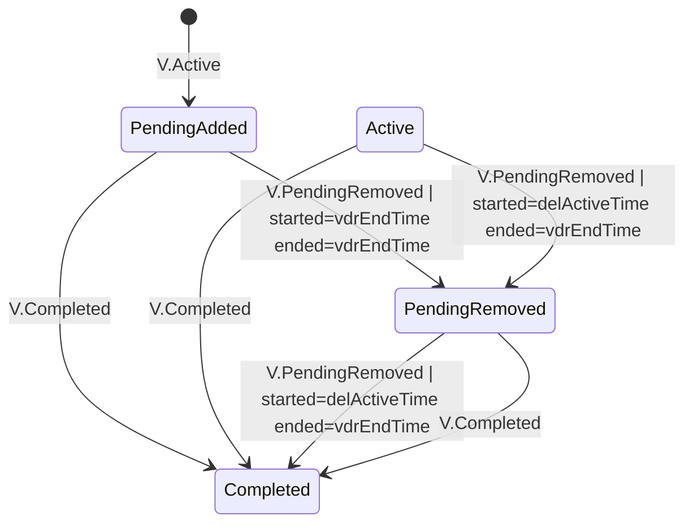

```mermaid
stateDiagram-v2
    %% Happy path
    [*] --> PendingAdded : V.Active
    %% PendingAdded --> Active : V.Active 
    %% Active --> PendingRemoved : V.Active | started=delActiveTime ended=now
    %% PendingRemoved --> Completed : V.Active 

    %% Delegator registration, validator complete
    PendingAdded --> PendingRemoved : V.PendingRemoved | started=vdrEndTime ended=vdrEndTime
    PendingAdded --> Completed : V.Completed 

    %% DelegatorEnding, validator complete
    Active --> PendingRemoved : V.PendingRemoved | started=delActiveTime ended=vdrEndTime
    Active --> Completed : V.Completed 
    PendingRemoved --> Completed : V.PendingRemoved | started=delActiveTime ended=vdrEndTime 
    PendingRemoved --> Completed : V.Completed
```