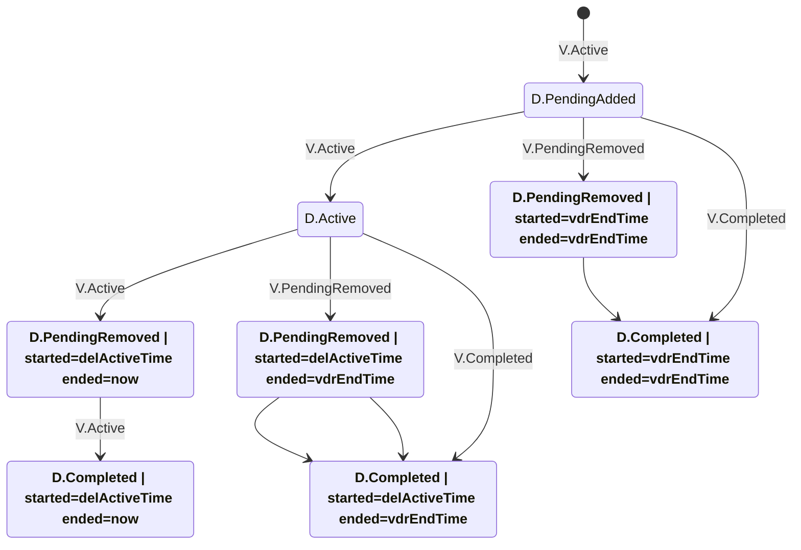

```mermaid
stateDiagram-v2
    classDef myState font-weight:bold
    pr:  D.PendingRemoved | started=delActiveTime ended=now
    c: D.Completed | started=delActiveTime ended=now
    prA: D.PendingRemoved | started=vdrEndTime ended=vdrEndTime
    cA: D.Completed | started=vdrEndTime ended=vdrEndTime
    prB: D.PendingRemoved | started=delActiveTime ended=vdrEndTime
    cB: D.Completed | started=delActiveTime ended=vdrEndTime

    %% Happy path
    [*] --> D.PendingAdded : V.Active
    D.PendingAdded --> D.Active : V.Active 
    D.Active --> pr:::myState : V.Active
    pr:::myState --> c:::myState : V.Active 

    %% Delegator registration, validator complete
    D.PendingAdded --> prA:::myState : V.PendingRemoved
    prA --> cA:::myState
    D.PendingAdded --> cA:::myState : V.Completed 

    %% DelegatorEnding, validator complete
    D.Active --> prB:::myState : V.PendingRemoved
    D.Active --> cB:::myState : V.Completed 
    prB:::myState --> cB:::myState
    prB:::myState --> cB:::myState
```